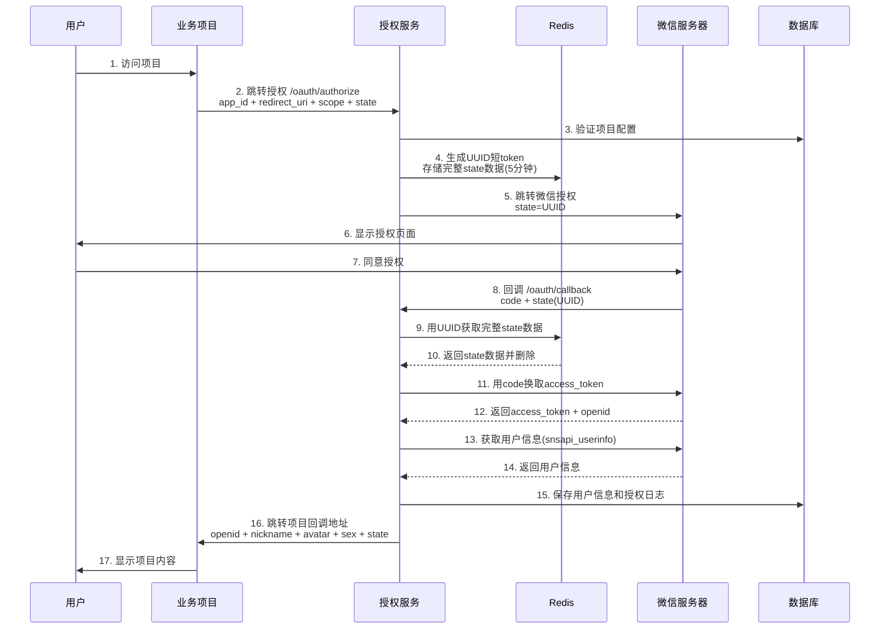

# 微信服务号授权统一平台

## 项目简介

这是一个微信服务号授权统一平台，用于统一管理多个项目的微信OAuth授权和JSSDK签名服务。

## 技术栈

- 后端：Nest.js + TypeScript + MySQL + Redis
- 前端：React 18 + Ant Design 5

## 快速开始

### 后端服务

1. 安装依赖
```bash
cd server
npm install
```

2. 配置环境变量
```bash
cp .env.example .env
# 编辑.env文件，填入数据库和微信配置
```

3. 启动开发服务器
```bash
npm run start:dev
```

服务将在 http://localhost:3000 启动

### 前端管理后台

```bash
cd admin
npm install
npm run dev
```

## 核心功能

### 1. OAuth授权
- 静默授权（snsapi_base）- 只获取openid
- 用户授权（snsapi_userinfo）- 获取昵称、头像、性别等完整信息
- **Redis缓存state数据** - 解决微信128字节限制，使用UUID短token
- 自动保存用户信息到数据库
- 授权日志记录
- 5分钟授权有效期，过期自动清理

### 2. JSSDK签名
- 自动生成签名
- 支持分享卡片等功能

### 3. 项目管理
- 项目配置管理
- 回调域名配置
- 项目启用/禁用

### 4. 数据统计
- 授权日志查询
- 用户列表查看
- 统计分析

## 详细使用教程

### 第一步：在管理后台添加项目

1. 访问管理后台（默认：http://localhost:5173）
2. 使用管理员账号登录（默认：admin/admin123）
3. 进入"项目管理"，点击"添加项目"
4. 填写项目信息：
   - **项目名称**: 你的项目名称
   - **App ID**: 自定义的项目标识（英文+数字，如：my_project_001）
   - **回调地址**: 项目的回调地址（如：https://your-project.com/callback）
5. 保存后获得 `app_id`

### 第二步：在项目中发起授权

在你的项目中，引导用户访问授权URL：

```javascript
// 构造授权URL
const authUrl = `https://auth.yourdomain.com/api/oauth/authorize?` +
  `app_id=my_project_001&` +
  `redirect_uri=https://your-project.com/callback&` +
  `scope=snsapi_userinfo&` +
  `state=custom_state`;

// 跳转到授权页面
window.location.href = authUrl;
```

**参数说明：**
- `app_id`: 在管理后台创建的项目ID（必填）
- `redirect_uri`: 项目的回调地址（可选，用于验证，必须与管理后台配置一致）
- `scope`: 授权类型（可选，默认snsapi_base）
  - `snsapi_base`: 静默授权，只获取openid
  - `snsapi_userinfo`: 用户信息授权，获取昵称、头像等
- `state`: 自定义参数（可选），授权后会原样返回

### 第三步：处理回调

用户授权后，会跳转到你配置的回调地址，并携带用户信息：

```
https://your-project.com/callback?
  openid=oxxxxxxxxxxxxxx&
  nickname=张三&
  avatar=http://thirdwx.qlogo.cn/...&
  sex=1&
  state=custom_state
```

**返回参数：**
- `openid`: 用户的唯一标识（必有）
- `nickname`: 用户昵称（snsapi_userinfo模式）
- `avatar`: 用户头像URL（snsapi_userinfo模式）
- `sex`: 用户性别，0=未知，1=男，2=女（snsapi_userinfo模式）
- `state`: 原始的state参数

在你的项目中接收这些参数：

```javascript
// 解析URL参数
const params = new URLSearchParams(window.location.search);
const openid = params.get('openid');
const nickname = decodeURIComponent(params.get('nickname') || '');
const avatar = decodeURIComponent(params.get('avatar') || '');
const sex = params.get('sex');
const state = params.get('state');

// 保存用户信息到你的系统
saveUserInfo({ openid, nickname, avatar, sex });
```

## OAuth授权流程图



## API接口

### OAuth授权

**发起授权**
```
GET /api/oauth/authorize
```

参数：
- `app_id` (必填): 项目ID
- `redirect_uri` (可选): 回调地址，用于验证
- `scope` (可选): 授权类型，默认snsapi_base
- `state` (可选): 自定义参数

**授权回调**
```
GET /api/oauth/callback
```

参数（微信回调）：
- `code`: 微信授权码
- `state`: UUID短token

返回（跳转到项目回调地址）：
- `openid`: 用户唯一标识
- `nickname`: 用户昵称（snsapi_userinfo）
- `avatar`: 用户头像（snsapi_userinfo）
- `sex`: 用户性别（snsapi_userinfo）
- `state`: 原始state参数

### JSSDK签名
```
POST /api/jssdk/signature
Body: { url: "xxx" }
```

### 项目管理
```
GET    /admin/projects
POST   /admin/projects
PUT    /admin/projects/:id
DELETE /admin/projects/:id
```

## 微信公众号配置

1. 登录微信公众平台
2. 设置与开发 -> 公众号设置 -> 功能设置
3. 配置JS接口安全域名：auth.yourdomain.com
4. 设置与开发 -> 接口权限 -> 网页授权
5. 配置授权回调域名：auth.yourdomain.com

## 注意事项

1. **Redis必须配置** - 用于存储state数据，解决微信128字节限制
2. 确保所有业务项目的回调地址配置正确
3. 生产环境必须配置HTTPS
4. Redis用于缓存state数据（5分钟有效期）和access_token
5. 定期清理授权日志，避免数据库过大
6. 建议配置Redis持久化，防止数据丢失

## 部署说明

### Docker部署（推荐）

项目已配置Docker支持，可以一键部署：

```bash
# 构建并启动
docker-compose up -d

# 查看日志
docker-compose logs -f
```

### 手动部署

1. 安装MySQL和Redis
2. 配置环境变量
3. 构建项目：`pnpm run build`
4. 启动服务：`pnpm run start:prod`

## 常见问题

### 1. 授权后提示"授权已过期"

原因：Redis中的state数据已过期（超过5分钟）或Redis连接失败

解决：
- 检查Redis是否正常运行
- 检查Redis连接配置是否正确
- 确保用户在5分钟内完成授权

### 2. 回调地址不匹配

原因：传入的redirect_uri与管理后台配置不一致

解决：
- 检查管理后台的项目配置
- 确保redirect_uri参数正确

### 3. 获取不到用户信息

原因：使用了snsapi_base授权模式

解决：
- 改用snsapi_userinfo授权模式
- 注意：snsapi_userinfo需要用户手动确认授权
